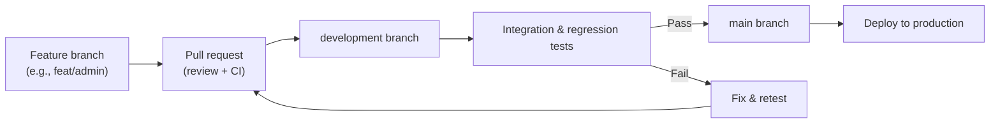

# 6. Implementation Details

This section describes the concrete implementation of TrailHub's architecture, detailing the modular structure, key code components, and design patterns employed in both the backend and frontend systems.

## 6.0 Branching Workflow Diagram (Git)

The development process follows a short-lived feature branch model with gated promotion through `development` to `main`, reinforced by CI checks and production deployment from `main` only. Feature branches are created per user story or task (e.g., `feat/hikes-123-add-route-maps`, `feat/admin-roles-approval`), using the Notion task ID in the branch name to keep traceability between PM artifacts and code changes. Each branch is scoped to a single story, remains short-lived, and merges into `development` via pull requests after review and automated tests; only validated changes are promoted from `development` to `main`.



This flow minimizes risk by isolating new work, validating in the shared `development` branch, and releasing only after tests succeed and changes are merged into `main`.

## 6.1 Backend Modular Structure

### 6.1.1 Directory Organization

The TrailHub backend follows a modular monolith pattern organized as follows:

```
src/
├── app/                    # Application bootstrap and global middleware
├── adapters/              # External service integrations (Firebase, storage)
├── middleware/            # Cross-cutting middleware (auth, logging, error handling)
├── modules/               # Domain-specific business logic
│   ├── users/            # User management
│   ├── guides/           # Guide profiles and management
│   ├── hikes/            # Hike CRUD and operations
│   ├── bookings/         # Booking management
│   ├── reviews/          # Reviews and ratings
│   └── administration/   # Admin-only features
├── shared/                # Reusable utilities and database access
├── routes/                # API route definitions
└── utils/                 # Application-level utilities
```

Each module in the `modules/` directory follows a consistent structure:
- **controller/** – Handles HTTP requests, input validation, and response formatting
- **repository/** – Encapsulates Prisma database queries and data transformations
- **utils/** – Module-specific utility functions and helpers

### 6.1.2 Application Bootstrap

The Express application is initialized with core middleware that establishes the request processing pipeline:

```javascript
// src/app.js
const express = require('express');
const cors = require('cors');
const morgan = require('morgan');
const routes = require('./routes');
const { authMiddleware } = require('./app/auth.middleware');
const { errorHandler, notFoundHandler } = require('./middleware/errorHandler');

const app = express();

// CORS configuration for development and production environments
app.use(cors({
  origin: ['http://localhost:5173', 'http://192.168.0.103:5173'],
  methods: ['GET', 'POST', 'PUT', 'DELETE', 'OPTIONS'],
  credentials: true
}));

// Parse incoming requests and set up logging
app.use(express.json());
app.use(morgan('tiny'));

// Authentication middleware populates req.user
app.use(authMiddleware);

// Route handling
app.use('/', routes);

// Error handlers
app.use(notFoundHandler);
app.use(errorHandler);
```

This initialization ensures that every request passes through authentication, logging, and CORS checks before reaching route handlers.

## 6.2 Controller-Repository Pattern

### 6.2.1 Controller Pattern

Controllers handle HTTP-level concerns: parsing parameters, validating input, enforcing authorization, and formatting responses. The following example demonstrates the user registration controller:

```javascript
// src/modules/users/controller/index.js (excerpt)
const { Router } = require('express');
const usersRepo = require('../repository');

const router = Router();

// POST /api/users/register
router.post('/register', async (req, res, next) => {
  try {
    const { firebaseUid, email, name, role } = req.body;

    if (!firebaseUid || !email) {
      return res.status(400).json({ 
        error: 'firebaseUid and email are required' 
      });
    }

    // Validate role (only hiker/guide allowed at registration)
    const validRoles = ['hiker', 'guide'];
    const userRole = validRoles.includes(role) ? role : 'hiker';

    const user = await usersRepo.createOrUpdateUser({
      firebaseUid,
      email,
      name,
      role: userRole,
    });

    return res.status(201).json(user);
  } catch (err) {
    next(err);
  }
});

module.exports = router;
```

Controllers delegate database operations to repositories, maintaining a clear separation of concerns.

### 6.2.2 Repository Pattern

Repositories encapsulate Prisma database queries and return application-friendly data structures. The repository layer constructs queries, applies filters, and transforms raw database records:

```javascript
// src/modules/users/repository/index.js (excerpt)
const { prisma } = require('../../../shared/prisma');

async function createOrUpdateUser({ firebaseUid, email, name, role = 'hiker' }) {
  if (!firebaseUid || !email) {
    throw new Error('firebaseUid and email are required');
  }

  // Normalize role (only hiker/guide allowed)
  const requestedRole = String(role).toLowerCase() === 'guide' 
    ? 'guide' 
    : 'hiker';

  // Check if user exists
  const existing = await prisma.user.findFirst({
    where: { OR: [{ firebaseUid }, { email }] },
  });

  if (existing) {
    // Block deleted accounts
    if (existing.status === 'DELETED') {
      const err = new Error('Account deleted');
      err.statusCode = 401;
      throw err;
    }

    // Update existing user
    return await prisma.user.update({
      where: { id: existing.id },
      data: {
        firebaseUid,
        email,
        name: name || existing.name,
        role: requestedRole,
      },
    });
  }

  // Create new user
  return await prisma.user.create({
    data: {
      firebaseUid,
      email,
      name,
      role: requestedRole,
      status: 'ACTIVE',
    },
  });
}

module.exports = { createOrUpdateUser };
```

This pattern isolates data access logic, making queries testable, maintainable, and reusable across controllers.

## 6.3 Authentication and Authorization

### 6.3.1 Authentication Middleware

The authentication middleware verifies Firebase ID tokens and enriches requests with user information:

```javascript
// src/app/auth.middleware.js (excerpt)
const { verifyIdToken } = require('../adapters/firebase.auth');
const { prisma } = require('../shared/prisma');

async function authMiddleware(req, res, next) {
  try {
    // Extract Bearer token from Authorization header
    const authHeader = req.headers.authorization;
    const token = authHeader?.startsWith('Bearer ')
      ? authHeader.slice(7)
      : null;

    if (token) {
      // Verify Firebase token
      const decoded = await verifyIdToken(token);
      if (decoded) {
        // Look up user in database to get role
        const user = await prisma.user.findFirst({
          where: { firebaseUid: decoded.uid },
        });

        req.user = {
          firebaseUid: decoded.uid,
          email: decoded.email,
          role: user?.role || 'visitor',
        };
      }
    } else {
      // Unauthenticated user
      req.user = { role: 'visitor' };
    }

    next();
  } catch (err) {
    console.error('[auth] Verification failed:', err);
    req.user = { role: 'visitor' };
    next();
  }
}

module.exports = { authMiddleware };
```

### 6.3.2 Role-Based Access Control

Authorization is enforced using role middleware that checks `req.user.role` before allowing access to protected endpoints:

```javascript
// src/app/roles.middleware.js (conceptual example)
function requireRole(...allowedRoles) {
  return (req, res, next) => {
    if (!allowedRoles.includes(req.user?.role)) {
      return res.status(403).json({ 
        error: 'Forbidden: insufficient permissions' 
      });
    }
    next();
  };
}

// Usage in route handlers
router.post('/hikes', requireRole('guide', 'admin'), createHikeHandler);
```

Four roles are enforced:
- **visitor** – unauthenticated users (read-only access)
- **hiker** – authenticated users (booking, reviews)
- **guide** – hike creators and managers
- **admin** – full system access (environment-based allowlist)

## 6.4 Error Handling

A centralized error response layer eliminates repetitive HTTP status code logic:

```javascript
// src/shared/errorResponses.js
const send400 = (res, error) => res.status(400).json({ error });
const send401 = (res, error = 'Unauthorized') => 
  res.status(401).json({ error });
const send403 = (res, error = 'Forbidden') => 
  res.status(403).json({ error });
const send404 = (res, error = 'Not found') => 
  res.status(404).json({ error });
const send500 = (res, error = 'Internal server error') => 
  res.status(500).json({ error });

module.exports = {
  send400, send401, send403, send404, send500
};
```

Controllers use these helpers to return consistent error responses. The global error handler catches unhandled exceptions:

```javascript
// src/middleware/errorHandler.js
function errorHandler(err, req, res, next) {
  console.error(err);
  const status = err.status || 500;
  res.status(status).json({ error: err.message || 'Internal Server Error' });
}
```

## 6.5 Frontend Architecture

### 6.5.1 Single-Page Application Setup

The frontend is a React-based SPA using Vite for bundling and hot module replacement:

```javascript
// frontend/src/main.jsx (excerpt)
import React, { useEffect, useState } from 'react';
import { createRoot } from 'react-dom/client';
import { BrowserRouter, Routes, Route } from 'react-router-dom';
import { onAuthStateChanged } from './firebase';

import Explore from './pages/Explore';
import HikeDetails from './pages/HikeDetails';
import CreateHike from './pages/CreateHike';
import AdminDashboard from './pages/admin/AdminDashboard';
import ProtectedRoute from './pages/ProtectedRoute';

function App() {
  const [user, setUser] = useState(null);
  const [loading, setLoading] = useState(true);

  useEffect(() => {
    const unsub = onAuthStateChanged(auth, (u) => {
      setUser(u);
      setLoading(false);
    });
    return () => unsub();
  }, []);

  if (loading) return <div>Loading...</div>;

  return (
    <BrowserRouter>
      <Routes>
        <Route path="/" element={<Explore />} />
        <Route path="/hikes/:id" element={<HikeDetails />} />
        <Route path="/create" element={
          <ProtectedRoute user={user} requiredRole="guide">
            <CreateHike />
          </ProtectedRoute>
        } />
        <Route path="/admin" element={
          <ProtectedRoute user={user} requiredRole="admin">
            <AdminDashboard />
          </ProtectedRoute>
        } />
      </Routes>
    </BrowserRouter>
  );
}
```

### 6.5.2 API Communication and Token Injection

The Axios HTTP client automatically attaches Firebase ID tokens to all authenticated requests:

```javascript
// frontend/src/api.js (excerpt)
import axios from 'axios';
import { auth } from './firebase';

const api = axios.create({ baseURL: '/api' });

// Request interceptor: attach Firebase ID token
api.interceptors.request.use(
  async (config) => {
    const user = auth.currentUser;
    config.headers = config.headers || {};

    if (user) {
      const token = await user.getIdToken(true);
      config.headers.Authorization = `Bearer ${token}`;
    }

    return config;
  },
  (error) => Promise.reject(error)
);

// Response interceptor: handle deleted accounts
api.interceptors.response.use(
  (response) => response,
  async (error) => {
    if (error?.response?.status === 401 && 
        error?.response?.data?.error === 'Account deleted') {
      await auth.signOut();
      window.location.href = '/';
    }
    return Promise.reject(error);
  }
);

export default api;
```

This approach centralizes authentication logic and eliminates repetitive token injection in component code.

### 6.5.3 Role-Based UI Rendering

The frontend dynamically adjusts visible features based on user role:

```javascript
// frontend/src/components/Header.jsx (excerpt)
export default function Header({ onOpenAuthModal }) {
  const [user, setUser] = useState(null);
  const [userRole, setUserRole] = useState(null);

  useEffect(() => {
    const unsub = onAuthStateChanged(auth, async (u) => {
      setUser(u);

      if (u) {
        try {
          const res = await api.get('/me');
          setUserRole(res.data.role);
        } catch (err) {
          console.error('Failed fetching role:', err);
          setUserRole(null);
        }
      } else {
        setUserRole(null);
      }
    });
    return () => unsub();
  }, []);

  return (
    <header>
      {user ? (
        <>
          {userRole === 'guide' && 
            <Link to="/create">Create Hike</Link>
          }
          {userRole === 'admin' && 
            <Link to="/admin">Admin Dashboard</Link>
          }
          <button onClick={() => auth.signOut()}>Sign Out</button>
        </>
      ) : (
        <button onClick={() => onOpenAuthModal()}>Sign In</button>
      )}
    </header>
  );
}
```

Protected routes ensure unauthorized users cannot access admin pages:

```javascript
// frontend/src/pages/ProtectedRoute.jsx (conceptual)
function ProtectedRoute({ user, requiredRole, children }) {
  if (!user) {
    return <Navigate to="/" />;
  }

  if (requiredRole && user.role !== requiredRole) {
    return <Navigate to="/" />;
  }

  return children;
}
```

## 6.6 Database Access Layer

### 6.6.1 Prisma ORM Integration

Database access is exclusively through Prisma, managed via a shared client instance:

```javascript
// src/shared/prisma.js
const { PrismaClient } = require('@prisma/client');

let prisma;

function getPrisma() {
  if (!prisma) {
    prisma = new PrismaClient({
      log: process.env.DATABASE_LOG === '1'
        ? ['query', 'info', 'warn', 'error']
        : ['warn', 'error'],
    });
  }
  return prisma;
}

module.exports = {
  prisma: getPrisma(),
  getPrisma,
};
```

This shared instance prevents connection pool exhaustion during development and testing.

### 6.6.2 Schema and Relationships

The Prisma schema defines core entities with relationships supporting the platform's domain logic:

```prisma
model User {
  id              String    @id @default(cuid())
  firebaseUid     String    @unique
  email           String    @unique
  name            String?
  role            String    @default("hiker")
  status          String    @default("ACTIVE")
  createdAt       DateTime  @default(now())
  updatedAt       DateTime  @updatedAt

  hikerProfile    HikerProfile?
  guide           Guide?
  bookings        Booking[]
  reviews         Review[]
}

model Guide {
  id              String    @id @default(cuid())
  userId          String    @unique
  displayName     String?
  status          String    @default("ACTIVE")
  hikes           Hike[]

  user            User      @relation(fields: [userId], references: [id])
}

model Hike {
  id              String    @id @default(cuid())
  guideId         String
  title           String
  difficulty      String
  distance        Float?
  bookings        Booking[]
  reviews         Review[]

  guide           Guide     @relation(fields: [guideId], references: [id])
}
```

Entity relationships facilitate complex queries without compromising data integrity.

## 6.7 External Service Adapters

### 6.7.1 Firebase Authentication Adapter

The Firebase adapter isolates authentication logic and credential management:

```javascript
// src/adapters/firebase.auth.js (excerpt)
const admin = require('firebase-admin');

function initAdminIfNeeded() {
  if (admin.apps?.length > 0) return;

  const privateKey = process.env.FIREBASE_PRIVATE_KEY
    .replace(/\\n/g, '\n');

  admin.initializeApp({
    credential: admin.credential.cert({
      projectId: process.env.FIREBASE_PROJECT_ID,
      clientEmail: process.env.FIREBASE_CLIENT_EMAIL,
      privateKey,
    }),
  });
}

async function verifyIdToken(idToken) {
  try {
    if (!idToken) return null;
    initAdminIfNeeded();

    const decoded = await admin.auth().verifyIdToken(idToken);
    return decoded; // { uid, email, name, ... }
  } catch (err) {
    console.error('[firebase] Token verification failed:', err);
    return null;
  }
}

module.exports = { verifyIdToken };
```

By encapsulating Firebase logic in an adapter, the application remains decoupled from Firebase's API details.

## 6.8 Design Patterns and Best Practices

### 6.8.1 Middleware Chain

The request processing pipeline uses Express middleware to compose concerns:

```
Request → CORS → JSON Parser → Logger → Authentication → 
Role Check → Route Handler → Repository → Prisma → 
Response/Error Handler → Client
```

Each middleware is independently testable and can be applied selectively to routes.

### 6.8.2 Error Propagation

Errors are caught at the controller level and passed to the global error handler via `next(err)`:

```javascript
router.post('/users', async (req, res, next) => {
  try {
    const user = await usersRepo.createOrUpdateUser(req.body);
    res.json(user);
  } catch (err) {
    // Propagate to global handler
    next(err);
  }
});
```

This centralized approach ensures consistent error responses and logging.

### 6.8.3 Stateless Authentication

The JWT-based authentication is stateless—the backend verifies tokens without maintaining sessions. This simplifies horizontal scaling and eliminates session store dependencies.

### 6.8.4 Dependency Injection via Requires

Modules explicitly import dependencies, making data flow transparent:

```javascript
const { prisma } = require('../../../shared/prisma');
const { send400 } = require('../../../shared/errorResponses');
```

This approach clarifies module dependencies and facilitates testing through mocking.

## 6.9 Code Organization Summary

TrailHub's implementation demonstrates modular architecture principles through:

- **Separation of Concerns** – HTTP logic (controllers) separated from data access (repositories)
- **Reusability** – Shared utilities, error responses, and database clients prevent duplication
- **Testability** – Clear boundaries between layers enable unit and integration testing
- **Maintainability** – Domain-specific modules can evolve independently with minimal cross-module impact
- **Scalability** – Modular structure supports adding new features and modules without refactoring core systems

This structure positions TrailHub to scale from a single deployable monolith to a microservices architecture if business needs demand it in the future.
